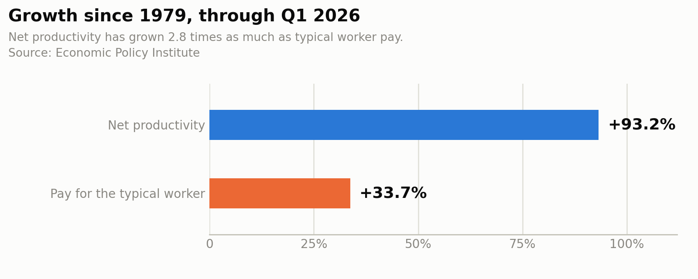
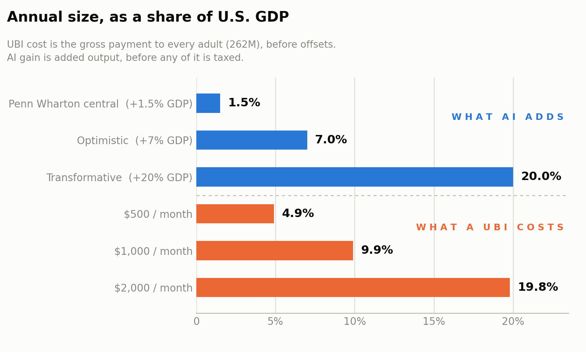

Somewhere between "AI takes all the jobs" and "AI makes everyone rich" sits a
question nobody wants to do the math on: if machines get dramatically more
productive over the next fifteen years, does that surplus end up funding a
decent life for everyone? It's the Star Trek premise — nobody works for money
because there's enough of everything. I went looking for the numbers behind
that idea, and found something more interesting than either the doom or the
utopia. The productivity gains are real. The gap between those gains and a
living wage for everyone is enormous. And the reason has less to do with AI
than with what a living wage is actually made of.

## The gains are real, and smaller than the pitch

Start with the most careful forecast available. The Penn Wharton Budget Model
projects that generative AI raises the *level* of U.S. GDP by about **1.5% by
2035**, roughly 3% by 2055, and 3.7% by 2075. The annual contribution to
productivity growth peaks around 2032 at about 0.2 percentage points, then
fades as adoption saturates.

That's a real gain. It is not a phase change. For scale: 1.5% of a $31.8
trillion economy is roughly $480 billion a year — about the same as what
hyperscalers are expected to spend on AI capex in a *single year*, which
Goldman Sachs currently pegs at $527 billion for 2026 with upside toward $700
billion.

The Federal Reserve's July 2026 assessment is blunter still. AI-related
investment is contributing meaningfully to quarterly GDP growth, but on
productivity the conclusion is that micro-level gains are "not adding up in
aggregate." Sectoral productivity trends look about the same in high-exposure
and low-exposure industries.

The honest read: we are deep in the investment phase and early in the payoff
phase. That's not damning. Electricity and the computer both showed the same
lag, and Solow's quip about seeing computers everywhere except the productivity
statistics was made in 1987, about a decade before the gains showed up. If
you're bullish, this is exactly what the beginning looks like.

## The jobs picture is a closing door, not a bloodbath

The Stanford Digital Economy Lab's *Canaries in the Coal Mine* work is the
best empirical evidence we have, and its findings are more specific than the
headlines suggest.

Overall employment grew about 6% from November 2022 to June 2026, and the
most-AI-exposed quintile still grew about 4%. No mass displacement. But
employment for workers aged 22–25 in AI-exposed occupations now sits about
**19% below** where it would be had it tracked their less-exposed peers — a gap
that has widened steadily since mid-2025.

Two details matter more than the headline number. First, the mechanism is
reduced hiring, not layoffs. The door is closing, not opening onto a cliff.
Second, adjustment is happening through headcount rather than wages — the
research finds minimal compensation divergence across exposure levels. Firms
are not paying people less; they are employing fewer of them.

That distinction matters enormously for the Star Trek question, and I'll come
back to it.

## Who gets the gains

Here's the thing the optimistic case has to answer. We have already run the
experiment where productivity rises and we see who catches the surplus.

Since 1979, net productivity is up about 93% while compensation for the typical
worker is up about 34% — productivity grew 2.8 times as much as pay. Over the
same era the labor share of income has fallen to its lowest level of the entire
postwar period, after sitting stably around 63% for most of the 20th century.
The New York Fed finds the post-COVID leg of that decline is driven by changes
*within* industries rather than shifts between them.

The counterargument deserves its due, because this chart is genuinely
contested. Stansbury and Summers examined the same data and concluded the
productivity–pay link is not broken: a one-point increase in productivity growth
still translates into roughly 0.7 to 1 points of median compensation growth.
Their reading is that productivity growth is still pushing pay up, while other
forces — declining union density, concentration, rising markups — push it down
harder. That is a meaningfully different diagnosis with a meaningfully different
prescription. But note that it doesn't rescue the optimistic case so much as
relocate the problem: either the gains don't reach workers, or they reach
workers and get taken back somewhere else.

## The arithmetic

So: could the AI dividend fund a universal basic income? This is where I
expected the numbers to be closer than they turned out to be.

There are about 262 million adults in the U.S. A UBI of $1,000/month to each of
them costs roughly $3.1 trillion a year — **about 10% of GDP**, and more than
half of all current federal revenue ($5.6 trillion in 2026, against $7.4
trillion in outlays).

| UBI level      | Annual gross cost | Share of GDP | vs. federal revenue |
| -------------- | ----------------- | ------------ | ------------------- |
| $250 / month   | $0.8T             | 2.5%         | 14%                 |
| $500 / month   | $1.6T             | 4.9%         | 28%                 |
| $1,000 / month | $3.1T             | 9.9%         | 56%                 |
| $2,000 / month | $6.3T             | 19.8%        | 112%                |

Now put the dividend beside it. Penn Wharton's central estimate — a 1.5% lift
to GDP by 2035 — doesn't cover even a $250/month payment, and that's assuming
you could tax 100% of the gain, which no one proposes and no government has
ever achieved. At a realistic capture rate of a third to a half, the central
forecast funds something on the order of $50–75 per adult per month.

You need the transformative scenario — AI adding 20% to GDP, more than ten
times the mainstream projection — before the new output alone is the same size
as a $2,000/month payment. And even then, only at complete confiscation of the
gain.

This is the single most important thing I took from the exercise. **The AI
dividend is not the funding mechanism.** Any serious UBI has to come from the
existing pie — a VAT, as Andrew Yang proposed; consolidation of existing
transfer programs; wealth or land taxation — which makes it a straightforward
distributional fight, not a windfall we grow into. The technology doesn't
resolve the politics. It doesn't even substantially fund one side of it.

## What the evidence says a UBI actually does

Set the funding aside and ask whether the policy works, because on that we now
have real data rather than theory.

OpenResearch's three-year unconditional cash study gave recipients $1,000/month
against a $50/month control. Recipients were 2 percentage points less likely to
be employed and worked 1.3 fewer hours per week. Earned income fell by about
$1,500 a year, and household income by $2,500–$4,100. But recipients were also
6 points *more* likely to be actively searching for work and 4.5 points more
likely to have applied for jobs — and with transfers included they were about
$10,000 a year better off individually.

The Alaska Permanent Fund is the closest thing to a permanent universal
transfer we've ever run. Across 1982–2014, the dividend had essentially **zero**
effect on the full-time employment-to-population ratio, while raising part-time
work by 1.8 percentage points. The authors attribute the null result to general
equilibrium effects: the money gets spent, spending creates demand, demand
creates jobs.

Read together, the picture is neither "people stop working" nor "no cost at
all." People work somewhat less, search somewhat more, and are considerably
better off. Whether that trade is worth $3 trillion a year is a values
question, and I don't think the data settles it. But the lazy version of the
objection — that cash transfers collapse the labor supply — isn't what the
evidence shows.

## The part nobody mentions: a UBI isn't a living wage

Here's the framing problem underneath the whole debate.

MIT's Living Wage Calculator puts the living wage for a single adult in
Washington at **$26.59/hour** — about $55,000 a year — against a state minimum
wage of $17.13. For two working adults with two children it's $33.87/hour each.
In California, $30.48 for a single adult.

A $1,000/month UBI is $12,000 a year. That is 22% of a single adult's living
wage in Washington. Even the most generous serious proposal on the table is a
*floor*, not a wage. The entire UBI conversation is about whether people should
be able to fall only so far — not about whether they can stop working. Anyone
promising that AI productivity converts into everyone getting a living wage for
free has skipped several orders of magnitude.

And the reason is structural, not fiscal. Look at what a living wage is made
of: housing, childcare, healthcare, food, transportation. Those costs are
dominated by land, energy, buildings, and in-person human care. AI automates
cognition. It is very good at the marginal cost of a legal memo, a code review,
a marketing plan — and nearly irrelevant to the marginal cost of a house in
Bellevue, an hour of a nurse's attention, or an acre anywhere near a city.

The Federation's post-scarcity economy doesn't run on smart software. It runs on
replicators and effectively free energy — the elimination of *material*
scarcity. That's the actual precondition, and it is a different technology than
the one we're building. Cheap cognition applied to an economy where the binding
constraints are physical mostly bids up the price of the physical things. If
everyone's productivity doubles and the housing stock doesn't, you get more
expensive housing, not abundance.

## So, are we on our way?

My honest read, holding both cases:

**The pessimistic case is currently winning on evidence.** Labor share is at a
postwar low, the productivity–pay gap is wide however you measure it, the
employment adjustment from AI is running through headcount rather than wages,
and the projected dividend is an order of magnitude too small to fund the
transfer that would offset it. Nothing in the 15-year forecast produces
post-scarcity.

**The optimistic case is not refuted, it's just not yet in evidence.** Every
general-purpose technology has been underestimated at this stage, the
productivity payoff has always lagged the investment by a decade or more, and
the Fed's "not adding up in aggregate" is precisely what 1987 looked like. If
the transformative scenario lands, the arithmetic above changes completely.

But here's the thing I didn't expect to conclude. Even in the optimistic case,
the Star Trek outcome doesn't arrive automatically, because the constraint was
never really productivity. We already produce enough. The 1979–2026 record is
the demonstration: we ran the productivity experiment, we got the growth, and
the distribution was a choice we made separately and badly. AI's specific
signature — gains concentrated in a handful of firms, losses spread thinly
across young workers who never get hired in the first place — makes that choice
politically harder, not easier. Concentrated winners organize. Diffuse losers
don't.

We're not on our way to a Star Trek civilization. We're on our way to a
significantly more productive version of the civilization we already have,
which will present us with the same distributional question we've been
answering the same way for forty-five years. The replicator doesn't decide
that. We do.

---

**Sources**

- [Penn Wharton Budget Model — The Projected Impact of Generative AI on Future Productivity Growth](https://budgetmodel.wharton.upenn.edu/p/2025-09-08-the-projected-impact-of-generative-ai-on-future-productivity-growth/)
- [Federal Reserve — The AI Buildout and the Economy (July 2026)](https://www.federalreserve.gov/econres/notes/feds-notes/the-ai-buildout-and-the-economy-publicly-available-data-to-assess-ais-impact-20260717.html)
- [Stanford Digital Economy Lab — Canaries in the Coal Mine? (August 2026)](https://digitaleconomy.stanford.edu/publication/canaries-in-the-coal-mine-six-facts-about-the-recent-employment-effects-of-artificial-intelligence/)
- [Economic Policy Institute — The Productivity–Pay Gap](https://www.epi.org/productivity-pay-gap/)
- [NY Fed Liberty Street Economics — The Post-COVID Decline in the Labor Share](https://libertystreeteconomics.newyorkfed.org/2026/06/the-post-covid-decline-in-the-labor-share/)
- [Stansbury &amp; Summers — Productivity and Pay: Is the Link Broken? (NBER w24165)](https://www.nber.org/system/files/working_papers/w24165/w24165.pdf)
- [OpenResearch — Unconditional Cash Study, employment and income findings](https://www.openresearchlab.org/findings/key-findings-employment-and-income)
- [Jones &amp; Marinescu — The Labor Market Impacts of Universal and Permanent Cash Transfers (NBER w24312)](https://www.nber.org/system/files/working_papers/w24312/w24312.pdf)
- [Congressional Budget Office — The Budget and Economic Outlook: 2026 to 2036](https://www.cbo.gov/publication/62105)
- [MIT Living Wage Calculator](https://livingwage.mit.edu/)
- [Goldman Sachs — Why AI Companies May Invest More than $500 Billion in 2026](https://www.goldmansachs.com/insights/articles/why-ai-companies-may-invest-more-than-500-billion-in-2026)

